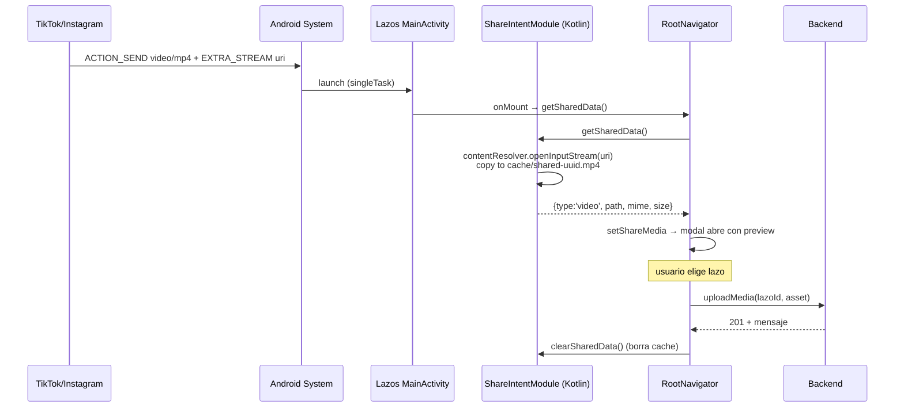

# Plan: arreglo de bugs + tiempo real

## Contexto

La app **Lazos** sufre cinco problemas reportados por el usuario que se cruzan en distintas capas:

1. **Bug de riego** — al terminar la animación de 3s, el indicador de "Tú" se vacía visualmente ~1s y luego se vuelve a llenar; el check mark del botón "se queda estancado". Causa: en `WateringIndicator` (`src/screens/lazos/LazosListScreen.tsx:172-249`), la fuente de animación cambia de `holdAnim` a `fillAnim` en el mismo frame en que `active` pasa a `true`, pero `fillAnim` solo se setea a `1` dentro del `useEffect` posterior — durante ese render intermedio el indicador renderiza con `fillAnim = 0` (vacío). El "check estancado" es un side-effect del mismo glitch porque el botón pierde la transición fluida.
2. **Badge de no leídos** — existe en `SideMenu` (línea 1209), pero **no se ve** en la pantalla principal (FAB "Chat"). El usuario quiere un badge circular superpuesto sobre el botón de mensajes.
3. **Notificaciones no funcionan** — falta `android/app/google-services.json` y `backend/firebase-service-account.json` (ambos gitignored — confirmado en `.gitignore`). Sin esos archivos Firebase Admin no inicializa (`backend/src/services/notificationService.ts:8-27`) y FCM en el dispositivo no recibe token válido (`src/services/notificationService.ts:40-60`).
4. **Lazos "fantasma"** — el borrado en `SideMenu.handleDelete` (LazosListScreen líneas 1093-1110) es optimista local + `setTimeout(4000)` antes del `DELETE` al backend. Cualquier `loadLazos()` durante esos 4s (vía `useFocusEffect` línea 1515 o evento `lazos:refresh`) trae el lazo de vuelta porque sigue existiendo en BD. Al cerrar y reabrir la app vuelve a aparecer.
5. **Crash en cold-start ocasional** — el segundo arranque funciona. Sospecha principal: `setupBackgroundHandler` en `index.js` y/o `registerForPushNotifications` en `RootNavigator.tsx:55` lanzan al inicializar Firebase sin `google-services.json` válido. El JNI crash mata el JS thread antes de que monten los componentes.
6. **No hay tiempo real** — el estado del lazo (riego del compañero, nuevos lazos, borrados) solo se refresca al volver a la pantalla (`useFocusEffect`) o vía FCM (que no funciona). El chat hace polling cada 3s (línea 539) — funcional pero no instantáneo. Para "todo en tiempo real" añadimos Socket.IO.

Se entrega un plan por sprints incrementales: cada sprint deja la app más robusta y puede mergearse independientemente.

---

## Vista general de los cambios

```mermaid
flowchart LR
  subgraph Cliente[App React Native]
    UI[LazosListScreen / ChatModal]
    UNREAD[unreadService]
    SOCK[realtimeService NEW]
    FCM[notificationService]
  end
  subgraph Backend[Node/Express]
    REST[REST API]
    WS[Socket.IO server NEW]
    DB[(PostgreSQL)]
    NOTIF[notificationService -- FCM]
  end
  UI -->|REST| REST
  UI <-->|tiempo real| SOCK
  SOCK <-->|WebSocket| WS
  WS -->|emit a sala lazo:{id}| Cliente
  REST -->|emit watering, message, delete| WS
  REST --> DB
  REST --> NOTIF
  NOTIF -->|push| FCM
  UNREAD -.->|incrementar| UI
  SOCK -.->|incrementar al recibir msg en background del chat| UNREAD
```

---

## Sprint 1 — Arreglo del riego y del badge de no leídos en el FAB

**Objetivo:** corregir el glitch visual del indicador "Tú" y mostrar el badge circular sobre el botón "Chat".

### 1.1 Fix watering indicator

Archivo: `src/screens/lazos/LazosListScreen.tsx`

Refactor del componente `WateringIndicator` (líneas 172-249):

- Eliminar el `fillAnim` separado. Mantener **un único Animated.Value** llamado `levelAnim` para el nivel de llenado (0 = vacío, 1 = lleno).
- El valor inicial de `levelAnim` se calcula con `useRef(new Animated.Value(active ? 1 : 0))`.
- Cuando llega `holdAnim` y el usuario está regando, el padre escribe sobre `levelAnim` directamente (en lugar de pasar dos valores). Para evitar reescribir todo el contrato, el componente acepta `holdAnim?: Animated.Value` y dentro de un `useEffect` añade un listener `holdAnim.addListener(({ value }) => levelAnim.setValue(value))` cuando `active === false`; cuando `active === true` quita el listener y simplemente mantiene `levelAnim = 1`.
- En el `useEffect` que reacciona a `active` (línea 206): cuando `active` cambia de `false → true`, hacer `levelAnim.setValue(1)` **antes** del próximo render mediante `Animated.timing(levelAnim, { toValue: 1, duration: 0 }).start()` o `levelAnim.setValue(1)` síncrono — esto evita el frame intermedio donde se ve vacío.
- `sourceAnim` y la lógica `!active && holdAnim ? holdAnim : fillAnim` desaparece; `translateY` usa siempre `levelAnim`.

Resultado: el indicador termina la animación de 3s con `levelAnim = 1`, el padre marca `iWateredToday = true`, el listener se desconecta, el indicador queda lleno sin parpadeo.

### 1.2 Botón vuelve a su estado original tras regar

Mismo archivo, función `WaterButton` (líneas 259-423):

- El icono `disabled ? 'check' : 'water'` está bien para el día (el check debe quedarse hasta mañana). Confirmar con el usuario es innecesario — el problema real era el indicador.
- Añadir limpieza explícita: cuando `disabled` pasa de `false → true`, parar cualquier `animRef.current` pendiente y resetear `holdAnimRef.current.setValue(1)` para que si el padre vuelve a re-renderizar no muestre transición espuria.

### 1.3 Badge de no leídos sobre el FAB "Chat"

Mismo archivo, función `LazosListScreen` (líneas 1472-1668):

- Suscribirse a `UNREAD_CHANGED` y a `getAllUnread()` (ya importados desde `src/services/unreadService.ts`). Patrón a copiar: el bloque idéntico en `SideMenu` líneas 1074-1088.
- Calcular `activeLazoUnread = unreadMap[activeLazo?.id] ?? 0`.
- Renderizar un `<View style={styles.fabChatBadge}>` absoluto sobre `<TouchableOpacity style={styles.fabChat}>` (línea 1640) cuando `activeLazoUnread > 0`. Usar `formatUnreadBadge(activeLazoUnread)` (ya existe en `unreadService.ts:63-67`).
- Estilos nuevos en el `StyleSheet` (cerca de `fabChat` línea 1715):
  ```ts
  fabChatBadge: {
    position: 'absolute',
    top: -6, right: -6,
    minWidth: 20, height: 20,
    paddingHorizontal: 6, borderRadius: 10,
    backgroundColor: '#D9534F',
    alignItems: 'center', justifyContent: 'center',
    borderWidth: 2, borderColor: C.bg,
  },
  fabChatBadgeText: { color: '#FFF', fontSize: 11, fontWeight: '700' },
  ```
- El `TouchableOpacity` del FAB necesita envolverse en un `<View>` con `position: 'relative'` o aplicar `overflow: 'visible'` para que el badge no quede recortado.

**Verificación Sprint 1:**
- Regar → el indicador "Tú" llega a 100% y se mantiene sin parpadeo, el botón muestra check.
- Enviar un mensaje desde el otro dispositivo → al volver al home, el FAB "Chat" muestra badge rojo con el conteo. Al abrir el chat, el badge desaparece (`clearUnread` ya se llama en `ChatModal` línea 522).

---

## Sprint 2 — Borrado de lazos persistente

**Objetivo:** que un lazo borrado **no reaparezca** al refrescar.

### 2.1 Lift de la lógica de pending-delete al padre

Archivo: `src/screens/lazos/LazosListScreen.tsx`

Diagrama del flujo nuevo:

```
USER tap trash
     │
     ▼
LazosListScreen.markPendingDelete(id)         ← añade a Set en estado
     │
     ├── filtra `lazos` antes de renderizar al SideMenu
     ├── arranca timer 4s
     └── muestra snackbar "Deshacer"
                          │
                ┌─────────┴────────┐
        UNDO (tap)            TIMER expira
                │                    │
        cancela timer       DELETE /lazos/:id
        quita id del Set    quita id del Set
        snackbar cierra     loadLazos()
```

Cambios concretos:

- En `LazosListScreen`, añadir `const [pendingDeleteIds, setPendingDeleteIds] = useState<Set<string>>(new Set());` y `const pendingTimersRef = useRef<Map<string, ReturnType<typeof setTimeout>>>(new Map());`
- Nueva función `markPendingDelete(lazoId: string)`:
  - Añade `lazoId` al set.
  - Si `activeLazo?.id === lazoId`, mueve `activeLazo` al siguiente lazo no-pending.
  - Programa `setTimeout(4000)` que llama `deleteLazoRemote(lazoId)`, quita `lazoId` del set, llama `loadLazos()`. Si el DELETE falla → muestra `Alert` y restaura visualmente.
- Nueva función `undoDelete(lazoId: string)`: cancela el timer, lo quita del set, lo quita del map.
- `loadLazos` (línea 1487): tras `setLazos(mapped)`, filtrar: `setLazos(mapped.filter(l => !pendingDeleteIds.has(l.id)))`. **Importante:** leer `pendingDeleteIds` desde un `ref` para evitar dependencias circulares — añadir `const pendingDeleteIdsRef = useRef<Set<string>>(new Set());` que se actualiza junto al state, y usar el ref dentro de `loadLazos`.
- Cleanup: `useEffect(() => () => { pendingTimersRef.current.forEach(t => clearTimeout(t)); }, [])`.

### 2.2 Adaptar SideMenu para delegar al padre

Mismo archivo, función `SideMenu` (líneas 1039-1292):

- Eliminar `localLazos` y todo el ciclo de `deletedLazo` + `pendingDeleteRef` + `undoTimer` internos (líneas 1059-1118). El menú deja de ser fuente de verdad para el borrado.
- Aceptar nuevas props desde el padre:
  - `pendingDeleteIds: Set<string>`
  - `onRequestDelete: (lazoId: string) => void`  (reemplaza a `onDeleteLazo`)
  - `onUndoDelete: (lazoId: string) => void`
  - `deletedSnackbar: { lazoId: string; partnerUsername: string } | null`
- El `FlatList` renderiza `lazos.filter(l => !pendingDeleteIds.has(l.id))`.
- El snackbar y su botón "Deshacer" usan los handlers del padre.
- La edición in-line del `partnerUsername` (overlay líneas 1255-1282) es solo cosmética/local — mantenerla tal cual (no se persiste, ya era así).

**Verificación Sprint 2:**
- Borrar un lazo → desaparece de la lista.
- Forzar `loadLazos` (cambiar de tab / fondo y vuelta) dentro de los 4s → el lazo sigue oculto.
- Tap "Deshacer" → el lazo vuelve y persiste en BD.
- Dejar pasar 4s → el lazo se borra en BD (verificar con `psql` o un `fetchLazos` fresh).
- Cerrar y abrir la app después de los 4s → el lazo no reaparece.

---

## Sprint 3 — Notificaciones FCM operativas

**Objetivo:** que las notificaciones push lleguen al dispositivo y se procesen sin crashear la app.

### 3.1 Documentar y verificar las credenciales

Archivos requeridos (ambos en `.gitignore`, deben provisionarse manualmente):

- `android/app/google-services.json` — descargar desde Firebase Console del proyecto Android `com.lazos`. Sin este archivo, `apply plugin: "com.google.gms.google-services"` (build.gradle línea 130) falla silenciosamente y FCM no se inicializa correctamente.
- `backend/firebase-service-account.json` — generar Service Account key desde Firebase Console → Project Settings → Service Accounts → Generate new private key. Sin este archivo, `notificationService.ts:18` lanza al hacer `require(resolvedPath)`, las notificaciones de servidor no se envían.

Añadir a `README.md` (o crear `docs/SETUP.md`) una sección "Configuración de Firebase" con estos dos pasos. **No commitear** estos archivos.

### 3.2 Endurecer cold-start contra fallos de Firebase

Archivo: `src/services/notificationService.ts`

- Envolver `messaging()` en una función helper `safeMessaging()` que haga lazy `require('@react-native-firebase/messaging').default` y devuelva `null` si lanza. Si devuelve `null`, todos los puntos de entrada (registerForPushNotifications, setupForegroundHandler, setupBackgroundHandler, listenForTokenRefresh) hacen no-op en lugar de propagar.
- En `setupBackgroundHandler` (líneas 120-136), capturar errores síncronos también: el `try/catch` en `index.js` solo cubre la llamada inmediata, no errores que vengan al primer `getMessage` después.

Archivo: `src/navigation/RootNavigator.tsx`

- Línea 54: aumentar el delay de `500ms → 2000ms` para `registerForPushNotifications`. Da margen a que el árbol de componentes termine de montarse y a Play Services en cold-start.
- Línea 44-48: envolver `setupForegroundHandler` en `try/catch` igual que `index.js`.

### 3.3 Notificación con `data-only` como respaldo

Archivo: `backend/src/services/notificationService.ts`

Hoy se envían notificaciones tipo `notification: { title, body }` (línea 44). Cambiar a payload **mixto** que incluya `data` siempre y `notification` para que Android la pinte, **pero también** activar el background handler con un fallback `data-only` cuando el receptor está en foreground:

- En `sendToToken` añadir `data: { ...data, title, body }` y mantener `notification: { title, body }`. Así el handler de RN siempre recibe los datos completos.
- En `apns` (iOS futuro) y `android.priority: 'high'` ya están configurados — mantener.

**Verificación Sprint 3:**
- Con `google-services.json` en su sitio: cold-start no crashea, `console.log` del token aparece (`[notifications] FCM token registrado: ...`).
- Con `firebase-service-account.json` en su sitio: enviar un mensaje desde un dispositivo → el otro recibe push aunque la app esté cerrada.
- Sin las credenciales: la app arranca igual (no crashea), los logs avisan "Firebase Admin no inicializado", el resto de la app sigue funcionando.

---

## Sprint 4 — Tiempo real con Socket.IO

**Objetivo:** que cualquier acción (riego, mensaje, borrado de lazo) se vea en el otro dispositivo en <1s sin tener que cerrar/abrir la app.

### 4.1 Backend: añadir Socket.IO

Archivos:

- `backend/package.json`: añadir `"socket.io": "^4.7.5"` a dependencies.
- `backend/src/realtime.ts` (nuevo): exporta `initRealtime(server)`, `emitToLazo(lazoId, event, payload)`, `emitToUser(userId, event, payload)`. Mantiene un mapa `userId → Set<socketId>` en memoria.
- `backend/src/index.ts`: reemplazar `app.listen(PORT, ...)` por:
  ```ts
  import http from 'http';
  import { initRealtime } from './realtime';
  const server = http.createServer(app);
  initRealtime(server);
  server.listen(PORT, () => { ... });
  ```
- Middleware de auth del socket: verifica JWT que llega en `socket.handshake.auth.token` con `jsonwebtoken.verify` (mismo secret que `backend/src/middleware/auth.ts`). En `connection`, el cliente emite `join` con un array de `lazoId`s, el servidor verifica que el usuario pertenece a cada lazo (query a `lazos`) y los une con `socket.join(\`lazo:${lazoId}\`)`.

Eventos que el servidor emite:
- `message:new` → en `messagesController.sendMessage` (línea 128) y `sendMediaMessage` (línea 226), añadir `emitToLazo(lazoId, 'message:new', msg)` después de `res.status(201).json(...)`.
- `message:reaction` → en `reactionsController.toggleReaction` tras responder.
- `watering:update` → en `lazosController.waterLazo` (línea 286), añadir `emitToLazo(lazoId, 'watering:update', { lazoId, partnerWateredToday: true, streak, plantPhase, plantXp, justStreaked, wateredByUserId: userId })`.
- `lazo:deleted` → en `lazosController.deleteLazo` (línea 331), `emitToUser(partnerId, 'lazo:deleted', { lazoId, deleterUsername })`.
- `lazo:created` → en `lazosController.joinLazo` (línea 134), `emitToUser(invite.creator_id, 'lazo:created', { lazoId, partnerUsername: joiner.username })`.

### 4.2 Cliente: servicio de realtime

Archivos:

- `package.json` raíz: añadir `"socket.io-client": "^4.7.5"`.
- `src/services/realtimeService.ts` (nuevo):
  ```ts
  // Pseudocódigo del contrato
  let socket: Socket | null = null;
  export async function connectRealtime(): Promise<void> {
    const token = await getToken();
    if (!token) return;
    socket = io(SOCKET_BASE_URL, { auth: { token }, transports: ['websocket'] });
    socket.on('connect', () => { /* se rehacen los joins */ });
    socket.on('message:new', m => DeviceEventEmitter.emit('rt:message:new', m));
    socket.on('watering:update', p => DeviceEventEmitter.emit('rt:watering', p));
    socket.on('lazo:deleted', p => DeviceEventEmitter.emit('rt:lazo:deleted', p));
    socket.on('lazo:created', p => DeviceEventEmitter.emit('rt:lazo:created', p));
    socket.on('message:reaction', p => DeviceEventEmitter.emit('rt:message:reaction', p));
  }
  export function joinLazos(ids: string[]) { socket?.emit('join', ids); }
  export function disconnectRealtime() { socket?.disconnect(); socket = null; }
  ```
- `src/constants/index.ts`: añadir `export const SOCKET_BASE_URL = 'https://lazos.axeldchosting.org';` (sin `/api` — Socket.IO se monta en root).

### 4.3 Conexión y propagación a la UI

Archivo: `src/context/AuthContext.tsx`

- Tras `setUser(...)` en login/register/bootstrap, llamar `connectRealtime()`.
- En `logout`, llamar `disconnectRealtime()`.

Archivo: `src/screens/lazos/LazosListScreen.tsx`

- En el `useEffect` de líneas 1518-1531, además de los listeners actuales, añadir:
  - `rt:watering` → actualizar el lazo afectado en `setLazos` y `setActiveLazo` exactamente como hace `handleWater` (líneas 1543-1554) pero sin disparar la llamada API (el evento ya viene del backend después del cambio).
  - `rt:lazo:deleted` → llamar `loadLazos()` y mostrar alert (idéntico al actual line 1525).
  - `rt:lazo:created` → llamar `loadLazos()`.
- Llamar `joinLazos(lazos.map(l => l.id))` desde un `useEffect` que dependa de `[lazos.length]` (o un hash de IDs) para reincorporarse a salas cuando cambia la lista.

Archivo: `src/screens/lazos/LazosListScreen.tsx` → `ChatModal`

- En el `useEffect` de polling (líneas 530-572), **mantener** el polling como fallback pero bajarlo de 3s a 10s.
- Añadir listener `rt:message:new` que inserta el mensaje en `messages` si `m.lazoId === lazo.id` (con dedupe por id, ya hay lógica similar en `handleSend` líneas 612-619).
- Añadir listener `rt:message:reaction` que actualiza `reactions` del mensaje.

**Verificación Sprint 4:**
- Dos dispositivos en el mismo lazo, ambos en pantalla principal: A riega → en <1s, B ve los indicadores y la racha actualizarse sin moverse de pantalla.
- A está en chat, B envía un mensaje → A lo ve aparecer sin esperar a los 10s del polling.
- A borra el lazo → B recibe el alert al instante.
- Matar el backend → reconectar → los clientes vuelven a la sala automáticamente (`socket.on('connect')`).

---

## Sprint 5 — Compartir desde TikTok / Instagram (fotos y videos)

**Objetivo:** que Lazos aparezca como destino en el menú "Compartir" de otras apps para enlaces de TikTok y archivos de Instagram (foto/video), reutilizando el chat picker que ya existe en `RootNavigator`.

Estado actual:
- `AndroidManifest.xml:35-39` declara intent-filter solo para `text/plain` → TikTok funciona (comparte el link), Instagram **no** funciona para fotos/videos.
- `ShareIntentModule.kt:30-41` solo lee `EXTRA_TEXT`.
- `RootNavigator.tsx:76-87` solo envía texto vía `sendMessage`.

### 5.1 Ampliar el `AndroidManifest.xml`

Archivo: `android/app/src/main/AndroidManifest.xml` — debajo del intent-filter existente (línea 39), añadir:

```xml
<intent-filter>
    <action android:name="android.intent.action.SEND" />
    <category android:name="android.intent.category.DEFAULT" />
    <data android:mimeType="image/*" />
</intent-filter>
<intent-filter>
    <action android:name="android.intent.action.SEND" />
    <category android:name="android.intent.category.DEFAULT" />
    <data android:mimeType="video/*" />
</intent-filter>
<intent-filter>
    <action android:name="android.intent.action.SEND_MULTIPLE" />
    <category android:name="android.intent.category.DEFAULT" />
    <data android:mimeType="image/*" />
</intent-filter>
<intent-filter>
    <action android:name="android.intent.action.SEND_MULTIPLE" />
    <category android:name="android.intent.category.DEFAULT" />
    <data android:mimeType="video/*" />
</intent-filter>
```

Nota: no usar `*/*` para no aparecer en todos los contextos.

### 5.2 Extender `ShareIntentModule.kt`

Archivo: `android/app/src/main/java/com/lazos/ShareIntentModule.kt`

- Mantener la rama `text/*` existente.
- Añadir rama para `ACTION_SEND` con MIME `image/*` o `video/*`:
  - Leer `intent.getParcelableExtra<Uri>(Intent.EXTRA_STREAM)`.
  - Resolver el MIME real con `ctx.contentResolver.getType(uri)` (más fiable que el del intent).
  - Copiar el stream a `ctx.cacheDir/shared-<uuid>.<ext>` con `contentResolver.openInputStream(uri)` y `FileOutputStream`. Esto es **necesario** porque la URI `content://` de la app de origen puede caducar al cerrar el intent.
  - Devolver `WritableNativeMap` con `type: 'photo' | 'video'`, `path: file.absolutePath`, `mime: resolvedMime`, `size: file.length()`.
- Añadir rama `ACTION_SEND_MULTIPLE`: iterar `intent.getParcelableArrayListExtra<Uri>(Intent.EXTRA_STREAM)` y devolver un array. Para MVP, **solo tomar el primero** y emitir un warning — el chat envía mensajes individuales y manejar batch complica la UI. Documentar como TODO multi-item.
- En `clearSharedData`, además de limpiar action/type, borrar el archivo en cache si existe (`File(path).delete()`).

### 5.3 Actualizar tipo y servicio en JS

Archivo: `src/services/shareIntent.ts`

Reemplazar el tipo:
```ts
export type SharedData =
  | { type: 'text';  data: string }
  | { type: 'photo' | 'video'; path: string; mime: string; size: number };
```

### 5.4 Routing en `RootNavigator.tsx`

Archivo: `src/navigation/RootNavigator.tsx`

- `useEffect` línea 61: aceptar también `data.type === 'photo' | 'video'` y guardar en un estado nuevo `[shareMedia, setShareMedia]` para abrir el mismo modal pero mostrando preview de imagen/video.
- `handleShareToLazo` (líneas 76-87): bifurcar:
  - Si `shareText` → `sendMessage(lazoId, shareText)` (actual).
  - Si `shareMedia` → construir un `Asset`-like (`{ uri: 'file://' + path, type: mime, fileName: basename }`) y llamar `uploadMedia(lazoId, asset)` (ya existe en `src/services/mediaService.ts:82`). Tras éxito, `clearSharedData()` y `setShareMedia(null)`.
- Preview del modal:
  - `text` → bloque actual con `sheetPreview`.
  - `photo` → `<Image source={{ uri: 'file://' + path }} style={...} resizeMode="cover" />`.
  - `video` → caja con icono `play-circle` y nombre del archivo (no reproducir aquí, no merece la complejidad).

### 5.5 Permisos y notas

- Las URIs entregadas por TikTok/Instagram vienen con permisos temporales (`FLAG_GRANT_READ_URI_PERMISSION`) que duran lo que la activity. Como copiamos a cache inmediatamente, no hay riesgo.
- No requiere permisos extra en `AndroidManifest.xml` — `READ_MEDIA_IMAGES/VIDEO` (líneas 7-8) ya están para el image-picker propio y no aplican a URIs compartidas con grant temporal.

**Verificación Sprint 5:**
- Abrir TikTok → video → Compartir → "Lazos" aparece en la lista → tap → modal muestra el link → elegir lazo → mensaje llega como texto.
- Abrir Instagram → foto → Compartir → "Lazos" aparece → tap → preview de la imagen → elegir lazo → mensaje tipo `photo` llega al chat con la imagen.
- Repetir con video de Instagram → mensaje tipo `video` llega al chat.
- Cancelar el modal → archivo de cache se elimina.



---

## Archivos modificados (resumen)

| Sprint | Archivo | Tipo |
|--------|---------|------|
| 1 | `src/screens/lazos/LazosListScreen.tsx` | Refactor `WateringIndicator`, `WaterButton`, badge FAB |
| 2 | `src/screens/lazos/LazosListScreen.tsx` | Pendientes de borrado en padre, simplificación `SideMenu` |
| 3 | `src/services/notificationService.ts` | safeMessaging wrapper |
| 3 | `src/navigation/RootNavigator.tsx` | Delay y try/catch |
| 3 | `backend/src/services/notificationService.ts` | Payload mixto data+notification |
| 3 | `README.md` (o `docs/SETUP.md`) | Sección Firebase setup |
| 4 | `backend/package.json` | + socket.io |
| 4 | `backend/src/realtime.ts` | **Nuevo** |
| 4 | `backend/src/index.ts` | http.createServer + initRealtime |
| 4 | `backend/src/controllers/lazosController.ts` | emitToLazo en water/delete/join |
| 4 | `backend/src/controllers/messagesController.ts` | emitToLazo en send / sendMedia |
| 4 | `backend/src/controllers/reactionsController.ts` | emitToLazo en toggleReaction |
| 4 | `package.json` | + socket.io-client |
| 4 | `src/services/realtimeService.ts` | **Nuevo** |
| 4 | `src/constants/index.ts` | + SOCKET_BASE_URL |
| 4 | `src/context/AuthContext.tsx` | connect/disconnect en login/logout |
| 4 | `src/screens/lazos/LazosListScreen.tsx` | listeners realtime + joinLazos + polling 10s |
| 5 | `android/app/src/main/AndroidManifest.xml` | intent-filters image/video + SEND_MULTIPLE |
| 5 | `android/app/src/main/java/com/lazos/ShareIntentModule.kt` | leer EXTRA_STREAM, copiar a cache |
| 5 | `src/services/shareIntent.ts` | tipo discriminado photo/video/text |
| 5 | `src/navigation/RootNavigator.tsx` | preview multi-tipo + uploadMedia |

## Verificación end-to-end (al cerrar todos los sprints)

1. `cd backend && npm run build && npm start` arranca sin errores.
2. `npm start` + `npm run android` en dos dispositivos/emuladores con cuentas distintas.
3. Lazo entre A y B ya existente.
4. Test riego: A arrastra el botón → indicador llena suavemente sin parpadeo. B ve el indicador de A llenarse en <1s.
5. Test mensaje: B envía → A ve el mensaje aparecer instantáneamente con la app abierta; si A está en home, el badge sobre FAB "Chat" pasa de 0 a 1.
6. Test borrado: A borra lazo desde menú → desaparece, snackbar "Deshacer" 4s. A backgroundea/abre la app durante esos 4s → lazo sigue oculto. Pasa el timer → DELETE confirmado. B recibe alert "X eliminó su lazo" al instante.
7. Test crash cold-start: borrar `google-services.json` localmente → reinstalar app → arranca sin crashear (con logs de fallo de Firebase, pero la UI funciona).
8. Test notificaciones: con `google-services.json` y `firebase-service-account.json` en sitio, cerrar app de A → B envía mensaje → A recibe push.
9. Test share: TikTok → compartir video → Lazos aparece en sheet → link llega como mensaje al lazo elegido. Instagram → compartir foto → preview correcto → imagen llega al chat. Repetir con video de Instagram.
